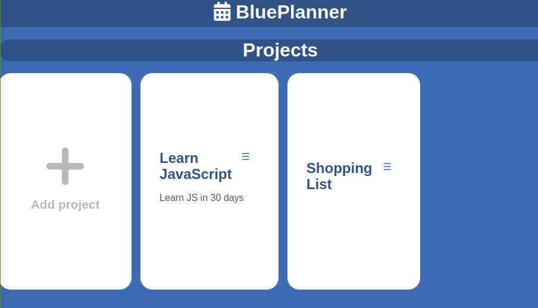
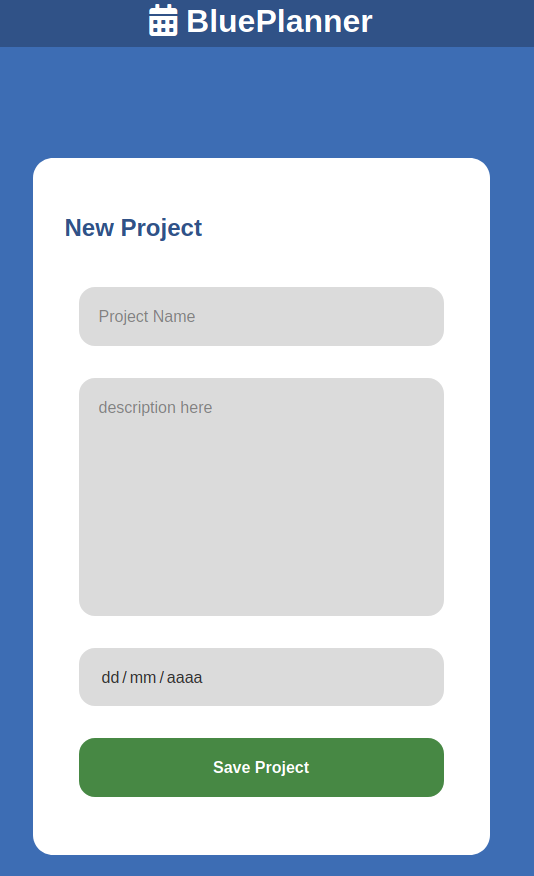
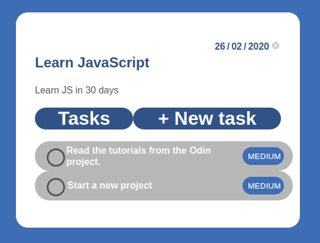

<!-- PROJECT SHIELDS -->
<!--
*** "reference style" links are used for readability.
*** Reference links are enclosed in brackets [ ] instead of parentheses ( ).
*** See the bottom of this document for the declaration of the reference variables
*** for contributors-url, forks-url, etc. This is an optional, concise syntax you may use.
*** https://www.markdownguide.org/basic-syntax/#reference-style-links
-->

[![Contributors][contributors-shield]][contributors-url]
[![Forks][forks-shield]][forks-url]
[![Stargazers][stars-shield]][stars-url]
[![Issues-open][issues-open-shield]][issues-open-url]
[![Issues-closed][issues-closed-shield]][issues-closed-url]

<!-- PROJECT LOGO -->
 

    
  

  <h1 align="center">
	Todo List
  </h1>

  

    A Tic Tac Toe game you can play in your browser! created with JS
     
	  🖊️
    <a href="https://www.theodinproject.com/courses/javascript/lessons/todo-list">Assigment</a>
    🐞
    <a href="https://github.com/fabricio-garcia/todo-js/issues">Report a Bug</a>
    🙋‍♂️
    <a href="https://github.com/fabricio-garcia/todo-js/issues">Request Feature</a>
  

# Specifications

- Object Oriented Programming
- Factory Functions
- Module Pattern
- Single Responsibility
- Tightly Coupled Objects

# Features

- Basic VanillaJS app with a single script or few commands
- JS modules and ES6+ available for most browsers
- Sets `stickler` on the repo
- Sets `eslint` rules
- Tests made with [`ESLint`](https://eslint.org/)

# Built With

- `LESS`
- `ESLint`
- `npm`
- Visual Studio Code
- WebStorm
- Webpack
- Linux/GNU
- Love and Passion for code

# Live Demo

[Link](http://blue-planner.surge.sh/)

 
 

# Build

## Prerequisites

- Node & NPM

### Run locally

- `npm i` - install dependencies
- `npm start` - start development server

### Where are generated files?

In `development` mode `webpack` does not write generated files to disk, in order to change it
switch `devServer.writeToDisk` to `true` in [webpack.dev.js](./webpack.dev.js)

### Run production build

- `npm run preview`

## Production

- `npm run build` to prepare `html`, `css`, `js` files in `dist/` directory

# Authors

👨 [Fabricio Garcia](https://github.com/fabricio-garcia)\
👨 [Israel Laguan](https://github.com/Israel-Laguan)

# 🤝 Contributing

Contributions, issues and feature requests are welcome!

# 🤗 Show your support

Give a ⭐️ if you like this project!

# 🏅 Acknowledgements

Give a ⭐️ if you like this project!

- [Microverse](https://www.microverse.org/)
- [The Odin Project](https://www.theodinproject.com/)

# 📝 License

This project is licensed under the Apache License 2.0\
Feel free to fork this project and improve it

<!-- MARKDOWN LINKS & IMAGES -->
<!-- https://www.markdownguide.org/basic-syntax/#reference-style-links -->

[contributors-shield]: https://img.shields.io/github/contributors/fabricio-garcia/todo-js?style=plastic
[contributors-url]: https://github.com/fabricio-garcia/todo-js/graphs/contributors
[forks-shield]: https://img.shields.io/github/forks/fabricio-garcia/todo-js?style=plastic
[forks-url]: https://github.com/fabricio-garcia/todo-js/network/members
[stars-shield]: https://img.shields.io/github/stars/fabricio-garcia/todo-js?style=plastic
[stars-url]: https://github.com/fabricio-garcia/todo-js/stargazers
[issues-open-shield]: https://img.shields.io/github/issues/fabricio-garcia/todo-js?style=plastic
[issues-closed-url]: https://github.com/fabricio-garcia/todo-js/issues
[issues-closed-shield]: https://img.shields.io/github/issues-closed/fabricio-garcia/todo-js?style=plastic
[issues-open-url]: https://github.com/fabricio-garcia/todo-js/issues
